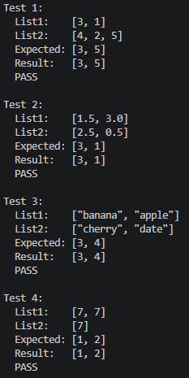

## Парадигма функціонального програмування, мова Хаскель

### Розділ 1. Варіант 57

*Вставити елементи одного списку у впорядкований за спаданням другий список. Сформувати список з номерами позицій, які займають елементи першого списку після вставки.*

### Код програми
```haskell
import Data.List (intercalate, sortBy)
import Data.Ord (comparing)

insertAndGetPositions :: Ord a => [a] -> [a] -> [Int]
insertAndGetPositions list1 list2 =
    let
        tagged1 = zipWith (\i x -> (x, Just i)) [0 ..] list1
        tagged2 = map (\x -> (x, Nothing)) list2
        sorted = sortBy (\(a, _) (b, _) -> compare b a) (tagged1 ++ tagged2)
        pairs = [ (oi, pos) | (pos, (_, Just oi)) <- zip [1 ..] sorted ]
    in map snd $ sortBy (comparing fst) pairs

showArray :: Show a => [a] -> String
showArray arr = "[" ++ intercalate ", " (map show arr) ++ "]"

runTest :: (Ord a, Show a) => Int -> [a] -> [a] -> [Int] -> IO ()
runTest n list1 list2 expected = do
    let result = insertAndGetPositions list1 list2
    putStrLn $ "Test " ++ show n ++ ":"
    putStrLn $ "  List1:    " ++ showArray list1
    putStrLn $ "  List2:    " ++ showArray list2
    putStrLn $ "  Expected: " ++ showArray expected
    putStrLn $ "  Result:   " ++ showArray result
    putStrLn $ if result == expected then "  PASS\n" else "  FAIL\n"

main :: IO ()
main = do
    runTest 1 ([3, 1] :: [Int]) [4, 2, 5] [3, 5]
    runTest 2 ([1.5, 3.0] :: [Double]) [2.5, 0.5] [3, 1]
    runTest 3 ["banana", "apple"] ["cherry", "date"] [3, 4]
    runTest 4 ([7, 7] :: [Int]) [7] [1, 2]
```

### Результати тестів
