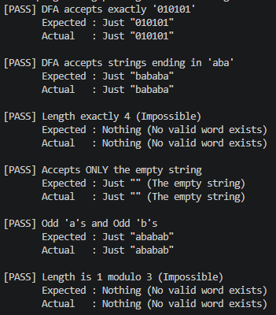

## Парадигма функціонального програмування, мова Хаскель

### Розділ 3. Варіант 13

*Виявити, чи допускає скінчений автомат хоча б одне слово, що може бути подане у вигляді xxx для деякого слова x. При ствердній відповіді навести приклад відповідного слова xxx.*

### Код програми
```haskell
import Data.Set (Set)
import qualified Data.Set as Set (empty, insert, member)
import Data.List (foldl')

data Queue a = Queue [a] [a]

emptyQueue :: Queue a
emptyQueue = Queue [][]

enqueue :: a -> Queue a -> Queue a
enqueue x (Queue inL outL) = Queue (x : inL) outL

dequeue :: Queue a -> Maybe (a, Queue a)
dequeue (Queue [][]) = Nothing
dequeue (Queue inL (x:xs)) = Just (x, Queue inL xs)
dequeue (Queue inL []) = dequeue (Queue[] (reverse inL))

data DFA q s = DFA
  { states       :: [q]
  , alphabet     :: [s]
  , transition   :: q -> s -> q
  , initialState :: q
  , acceptStates :: q -> Bool
  }

data SearchNode q = SearchNode
  { current1 :: q
  , current2 :: q
  , current3 :: q
  , guess1   :: q
  , guess2   :: q
  } deriving (Eq, Ord, Show)

bfs :: Ord node => (node -> [(label, node)]) -> [node] -> (node -> Bool) -> Maybe [label]
bfs nextNode starts isTarget = search Set.empty initialQueue
  where
    initialQueue = foldl' (flip enqueue) emptyQueue [ (s, []) | s <- starts ]

    search visited q = case dequeue q of
        Nothing -> Nothing
        Just ((curr, path), q')
          | isTarget curr -> Just (reverse path)
          | Set.member curr visited -> search visited q'
          | otherwise ->
              let visited' = Set.insert curr visited
                  neighbors =[ (n, l:path) | (l, n) <- nextNode curr, not (Set.member n visited') ]
                  q'' = foldl' (flip enqueue) q' neighbors
              in search visited' q''

findBaseWord :: (Ord q, Ord s) => DFA q s -> Maybe [s]
findBaseWord dfa =
    let qs = states dfa
        q0 = initialState dfa
        
        initialNodes =[ SearchNode q0 g1 g2 g1 g2 | g1 <- qs, g2 <- qs ]

        isTarget (SearchNode s1 s2 s3 g1 g2) =
            s1 == g1 && s2 == g2 && acceptStates dfa s3

        step (SearchNode s1 s2 s3 g1 g2) =[ (c, SearchNode (transition dfa s1 c)
                             (transition dfa s2 c)
                             (transition dfa s3 c)
                             g1 g2)
            | c <- alphabet dfa ]

    in bfs step initialNodes isTarget

findTripleWord :: (Ord q, Ord s) => DFA q s -> Maybe [s]
findTripleWord dfa = fmap (\x -> x ++ x ++ x) (findBaseWord dfa)

data TestCase = TestCase
    { testName :: String
    , testDFA  :: DFA Int Char
    , expected :: Maybe String
    }

dfaExactly010101 :: DFA Int Char
dfaExactly010101 = DFA
    { states =[0..7], alphabet =['0', '1'], transition = tr, initialState = 0, acceptStates = (== 6) }
  where
    tr 0 '0' = 1; tr 1 '1' = 2; tr 2 '0' = 3; tr 3 '1' = 4; tr 4 '0' = 5; tr 5 '1' = 6; tr _ _ = 7

dfaEndsInAba :: DFA Int Char
dfaEndsInAba = DFA
    { states =[0..3], alphabet = ['a', 'b'], transition = tr, initialState = 0, acceptStates = (== 3) }
  where
    tr 0 'a' = 1; tr 0 'b' = 0; tr 1 'a' = 1; tr 1 'b' = 2
    tr 2 'a' = 3; tr 2 'b' = 0; tr 3 'a' = 1; tr 3 'b' = 2; tr _ _ = 0

dfaLength4 :: DFA Int Char
dfaLength4 = DFA
    { states = [0..5], alphabet = ['x']
    , transition = \q _ -> if q < 5 then q + 1 else 5
    , initialState = 0, acceptStates = (== 4)
    }

dfaEmptyString :: DFA Int Char
dfaEmptyString = DFA
    { states = [0, 1], alphabet =['y']
    , transition = \_ _ -> 1
    , initialState = 0, acceptStates = (== 0)
    }

dfaOddAOddB :: DFA Int Char
dfaOddAOddB = DFA
    { states =[0..3], alphabet = ['a', 'b'], transition = tr, initialState = 0, acceptStates = (== 3) }
  where
    tr 0 'a' = 1; tr 0 'b' = 2
    tr 1 'a' = 0; tr 1 'b' = 3
    tr 2 'a' = 3; tr 2 'b' = 0
    tr 3 'a' = 2; tr 3 'b' = 1
    tr s _   = s

dfaMod3Is1 :: DFA Int Char
dfaMod3Is1 = DFA
    { states = [0..2], alphabet = ['z']
    , transition = \q _ -> if q == 2 then 0 else q + 1
    , initialState = 0, acceptStates = (== 1)
    }

-- | List grouping all test cases
testCases :: [TestCase]
testCases =[ TestCase "DFA accepts exactly '010101'"           dfaExactly010101 (Just "010101")
    , TestCase "DFA accepts strings ending in 'aba'"    dfaEndsInAba     (Just "bababa")
    , TestCase "Length exactly 4 (Impossible)"          dfaLength4       Nothing
    , TestCase "Accepts ONLY the empty string"          dfaEmptyString   (Just "")
    , TestCase "Odd 'a's and Odd 'b's"                  dfaOddAOddB      (Just "ababab")
    , TestCase "Length is 1 modulo 3 (Impossible)"      dfaMod3Is1       Nothing
    ]

formatResult :: Maybe String -> String
formatResult Nothing   = "Nothing (No valid word exists)"
formatResult (Just "") = "Just \"\" (The empty string)"
formatResult (Just s)  = "Just " ++ show s

runTest :: TestCase -> IO ()
runTest (TestCase name dfa expectedResult) = do
    let actualResult = findTripleWord dfa
    let isPass = actualResult == expectedResult
    let status = if isPass then "[PASS]" else "[FAIL]"
    
    putStrLn $ status ++ " " ++ name
    putStrLn $ "       Expected : " ++ formatResult expectedResult
    putStrLn $ "       Actual   : " ++ formatResult actualResult
    putStrLn ""

main :: IO ()
main = do
    mapM_ runTest testCases
```

### Опис алгоритму

У задачі потрібно знайти слово $x$ таке, що об'єднане слово $xxx$ приймається заданим скінченним автоматом (DFA) $M = (Q, \Sigma, \delta, q_0, F)$. 

Замість генерації рядкових префіксів, що створює нескінченний простір пошуку, алгоритм використовує концепцію **композиції автоматів**. Ми моделюємо одночасне зчитування невідомого слова $x$ на трьох окремих "доріжках".

Якщо існує коректне слово $x$, то зчитування $x$ з початкового стану $q_0$ залишить DFA в деякому проміжному стані $g_1$. Зчитування $x$ вдруге, починаючи з $g_1$, залишить DFA в іншому проміжному стані $g_2$. Нарешті, зчитування $x$ втретє, починаючи з $g_2$, залишить DFA в кінцевому, приймаючому стані $q_f \in F$.

Оскільки точний рядок $x$ невідомий, проміжні стани $g_1$ та $g_2$ також невідомі. Однак, множина станів $Q$ скінченна. Тому ми можемо закодувати наш простір пошуку як кортеж $(s_1, s_2, s_3, g_1, g_2)$, де $s_1, s_2, s_3$ - це динамічні поточні стани трьох "доріжок", а $g_1, g_2$ - це статичні "припущення" проміжних станів.

### Обґрунтування завершуваності

Оскільки DFA має скінченну кількість станів $|Q|$, максимальна кількість конфігурацій у просторі пошуку обмежена $|Q|^5$ (три динамічні доріжки та два статичні припущення). Використовуючи пошук у ширину (BFS) у поєднанні з `visited` набором, алгоритм систематично досліджує граф простору станів. 
1. **Якщо коректне слово існує:** BFS гарантує, що буде знайдено математично найкоротше слово $x$, оскільки він досліджує всі можливі шляхи довжини $k$ до довжини $k+1$.
2. **Якщо коректного слова не існує:** Простір пошуку повністю скінченний. Алгоритм детерміновано вичерпає всі досяжні стани, не потрапляючи в нескінченні цикли (завдяки `visited`, яка фільтрує цикли), і правильно поверне результат, що такого слова не існує.

### Опис ітеративного процесу

#### Ініціалізація (нульовий крок)
Ми ініціалізуємо порожню чергу та порожній `visited`. Для кожної можливої ​​комбінації проміжних станів $(g_1, g_2) \in Q \times Q$ ми будуємо початковий вузол $(q_0, g_1, g_2, g_1, g_2)$. Це представляє 0-й крок, де не було зчитано жодного символу: Доріжка 1 починається з початкового стану $q_0$, Доріжка 2 починається з $g_1$, а Доріжка 3 починається з $g_2$. Усі $|Q|^2$ цих початкових конфігурацій паруються з порожнім рядком `""` (що представляє пройдений шлях) та поміщаються в чергу BFS.

#### Загальний крок ітерації
На кожному кроці ми вилучаємо з черги передню конфігурацію $(s_1, s_2, s_3, g_1, g_2)$ та пов'язаний з нею шлях $w$. Для кожного символу $c$ в алфавіті $\Sigma$ ми обчислюємо перехід для всіх трьох активних доріжок:
$s_1' = \delta(s_1, c)$
$s_2' = \delta(s_2, c)$
$s_3' = \delta(s_3, c)$
Ми будуємо результуючий наступний вузол $(s_1', s_2', s_3', g_1, g_2)$. Якщо ця точна конфігурація вузла ще не була записана у `visited`, ми додаємо її до `visited` та ставимо її в чергу разом з оновленим шляхом $w + c$.

#### Умова припинення ітерації
Ітерація завершується за однієї з двох умов:
1. **Умова успіху:** Щойно вилучений з черги вузол отримує значення `True` для нашої цільової умови: $s_1 == g_1$ (Доріжка 1 успішно досягла першої вгаданої контрольної точки), $s_2 == g_2$ (Доріжка 2 успішно досягла другої вгаданої контрольної точки) та $s_3 \in F$. Алгоритм зупиняється та повертає накопичений рядок $w$.
2. **Умова невдачі:** Черга BFS стає повністю порожньою. Це означає, що кожну окрему досяжну конфігурацію вузла було відвідано без спрацювання умови успіху. Алгоритм зупиняється та повертає `Nothing`.

#### Оцінка максимальної кількості кроків
Максимальна кількість унікальних вузлів у просторі пошуку дорівнює добутку можливостей для кожного елемента в кортежі станів $(s_1, s_2, s_3, g_1, g_2)$, що дорівнює $|Q| \times |Q| \times |Q| \times |Q| \times |Q| = |Q|^5$.
На кожному кроці ми обробляємо переходи для кожного символу алфавіту $\Sigma$, що займає $O(|\Sigma|)$ операцій. Оскільки `visited` гарантує, що жоден вузол не буде поставлено в чергу або оброблено більше одного разу, найгірша часова складність (максимальна кількість кроків переходу) обмежена **$\mathcal{O}(|\Sigma| \cdot |Q|^5)$**. Просторова складність тотожно обмежена **$\mathcal{O}(|Q|^5)$** для зберігання черги та `visited`.

### Результати тестів
