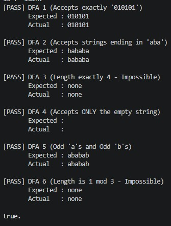

## Парадигма логічного програмування, мова Пролог

### Розділ 3. Варіант 13

*Виявити, чи допускає скінчений автомат хоча б одне слово, що може бути подане у вигляді xxx для деякого слова x. При ствердній відповіді навести приклад відповідного слова xxx.*

### Код програми
```prolog
:- discontiguous states/2.
:- discontiguous alphabet/2.
:- discontiguous start/2.
:- discontiguous accept/2.
:- discontiguous trans/4.

states(dfa1,[0,1,2,3,4,5,6,7]).
alphabet(dfa1,['0', '1']).
start(dfa1, 0).
accept(dfa1, 6).
trans(dfa1, 0, '0', 1) :- !.
trans(dfa1, 1, '1', 2) :- !.
trans(dfa1, 2, '0', 3) :- !.
trans(dfa1, 3, '1', 4) :- !.
trans(dfa1, 4, '0', 5) :- !.
trans(dfa1, 5, '1', 6) :- !.
trans(dfa1, _, _, 7).

states(dfa2,[0,1,2,3]).
alphabet(dfa2, ['a', 'b']).
start(dfa2, 0).
accept(dfa2, 3).
trans(dfa2, 0, 'a', 1) :- !.
trans(dfa2, 0, 'b', 0) :- !.
trans(dfa2, 1, 'a', 1) :- !.
trans(dfa2, 1, 'b', 2) :- !.
trans(dfa2, 2, 'a', 3) :- !.
trans(dfa2, 2, 'b', 0) :- !.
trans(dfa2, 3, 'a', 1) :- !.
trans(dfa2, 3, 'b', 2) :- !.
trans(dfa2, _, _, 0).

states(dfa3,[0,1,2,3,4,5]).
alphabet(dfa3, ['x']).
start(dfa3, 0).
accept(dfa3, 4).
trans(dfa3, 0, 'x', 1) :- !.
trans(dfa3, 1, 'x', 2) :- !.
trans(dfa3, 2, 'x', 3) :- !.
trans(dfa3, 3, 'x', 4) :- !.
trans(dfa3, 4, 'x', 5) :- !.
trans(dfa3, 5, 'x', 5) :- !.

states(dfa4,[0,1]).
alphabet(dfa4, ['y']).
start(dfa4, 0).
accept(dfa4, 0).
trans(dfa4, _, _, 1).

states(dfa5,[0,1,2,3]).
alphabet(dfa5, ['a', 'b']).
start(dfa5, 0).
accept(dfa5, 3).
trans(dfa5, 0, 'a', 1) :- !.
trans(dfa5, 0, 'b', 2) :- !.
trans(dfa5, 1, 'a', 0) :- !.
trans(dfa5, 1, 'b', 3) :- !.
trans(dfa5, 2, 'a', 3) :- !.
trans(dfa5, 2, 'b', 0) :- !.
trans(dfa5, 3, 'a', 2) :- !.
trans(dfa5, 3, 'b', 1) :- !.
trans(dfa5, S, _, S).

states(dfa6,[0,1,2]).
alphabet(dfa6, ['z']).
start(dfa6, 0).
accept(dfa6, 1).
trans(dfa6, 0, 'z', 1) :- !.
trans(dfa6, 1, 'z', 2) :- !.
trans(dfa6, 2, 'z', 0) :- !.

find_triple_word(DFA, TripleWordString) :-
    start(DFA, Q0),
    states(DFA, States),
    
    findall(
        node(Q0, G1, G2, G1, G2)-[],
        (member(G1, States), member(G2, States)),
        InitialQueue
    ),
    
    ( bfs(DFA, InitialQueue,[], ReversedPath) ->
        reverse(ReversedPath, BaseWord),
        append([BaseWord, BaseWord, BaseWord], TripleChars),
        string_chars(TripleWordString, TripleChars)
    ;   TripleWordString = none
    ).

bfs(DFA, [node(S1, S2, S3, G1, G2)-Path | _], _, Path) :-
    S1 == G1,
    S2 == G2,
    accept(DFA, S3),
    !.

bfs(DFA, [Node-_ | Queue], Visited, Path) :-
    memberchk(Node, Visited),
    !,
    bfs(DFA, Queue, Visited, Path).

bfs(DFA, [Node-Path | Queue], Visited, FinalPath) :-
    Node = node(S1, S2, S3, G1, G2),
    alphabet(DFA, Alphabet),
    
    findall(
        node(N1, N2, N3, G1, G2)-[C|Path],
        (
            member(C, Alphabet),
            trans(DFA, S1, C, N1),
            trans(DFA, S2, C, N2),
            trans(DFA, S3, C, N3)
        ),
        Children
    ),
    
    append(Queue, Children, NewQueue),
    bfs(DFA, NewQueue, [Node | Visited], FinalPath).

run_test(Name, DFA, Expected) :-
    find_triple_word(DFA, Actual),
    ( Actual == Expected -> Status = '[PASS]' ; Status = '[FAIL]' ),
    format('~w ~w~n       Expected : ~w~n       Actual   : ~w~n~n', 
           [Status, Name, Expected, Actual]).

main :-
    run_test("DFA 1 (Accepts exactly '010101')",        dfa1, "010101"),
    run_test("DFA 2 (Accepts strings ending in 'aba')", dfa2, "bababa"),
    run_test("DFA 3 (Length exactly 4 - Impossible)",   dfa3, none),
    run_test("DFA 4 (Accepts ONLY the empty string)",   dfa4, ""),
    run_test("DFA 5 (Odd 'a's and Odd 'b's)",           dfa5, "ababab"),
    run_test("DFA 6 (Length is 1 mod 3 - Impossible)",  dfa6, none).
```

### Опис алгоритму

У задачі потрібно знайти слово $x$ таке, що об'єднане слово $xxx$ приймається заданим скінченним автоматом (DFA) $M = (Q, \Sigma, \delta, q_0, F)$. 

Замість генерації рядкових префіксів, що створює нескінченний простір пошуку, алгоритм використовує концепцію **композиції автоматів**. Ми моделюємо одночасне зчитування невідомого слова $x$ на трьох окремих "доріжках".

Якщо існує коректне слово $x$, то зчитування $x$ з початкового стану $q_0$ залишить DFA в деякому проміжному стані $g_1$. Зчитування $x$ вдруге, починаючи з $g_1$, залишить DFA в іншому проміжному стані $g_2$. Нарешті, зчитування $x$ втретє, починаючи з $g_2$, залишить DFA в кінцевому, приймаючому стані $q_f \in F$.

Оскільки точний рядок $x$ невідомий, проміжні стани $g_1$ та $g_2$ також невідомі. Однак, множина станів $Q$ скінченна. Тому ми можемо закодувати наш простір пошуку як складений терм (кортеж) `node(S1, S2, S3, G1, G2)`, де `S1`, `S2`, `S3` - це динамічні поточні стани трьох "доріжок", а `G1`, `G2` - це статичні "припущення" проміжних станів.

### Обґрунтування завершуваності

Оскільки DFA має скінченну кількість станів $|Q|$, максимальна кількість конфігурацій у просторі пошуку обмежена $|Q|^5$ (три динамічні доріжки та два статичні припущення). Хоча стандартною стратегією Prolog є пошук у глибину (DFS), ми явно реалізуємо пошук у ширину (BFS) у поєднанні зі списком відвіданих вузлів `Visited`. Це дозволяє алгоритму систематично досліджувати граф простору станів:
1. **Якщо коректне слово існує:** BFS гарантує, що буде знайдено математично найкоротше слово $x$, оскільки він досліджує всі можливі шляхи довжини $k$ до довжини $k+1$. Оператор відсікання (`!`) гарантує зупинку пошуку при першому ж знайденому найкоротшому слові.
2. **Якщо коректного слова не існує:** Простір пошуку повністю скінченний. Алгоритм детерміновано вичерпає всі досяжні стани, не потрапляючи в нескінченні рекурсивні цикли (завдяки перевірці `memberchk` у списку `Visited`, яка фільтрує цикли), і правильно поверне результат, що такого слова не існує.

### Опис ітеративного процесу

#### Ініціалізація (нульовий крок)
За допомогою предикату `findall/3` ми генеруємо початкову чергу та ініціалізуємо порожній список відвіданих вузлів `[]`. Для кожної можливої ​​комбінації проміжних станів `(G1, G2)` зі списку станів автомата ми будуємо початковий терм-пару `node(Q0, G1, G2, G1, G2)-[]`. Це представляє 0-й крок, де не було зчитано жодного символу: Доріжка 1 починається з початкового стану `Q0`, Доріжка 2 починається з `G1`, а Доріжка 3 починається з `G2`. Усі $|Q|^2$ цих початкових конфігурацій паруються з порожнім списком `[]` (що представляє пройдений шлях) та формують початковий список черги.

#### Загальний крок ітерації
На кожному рекурсивному кроці ми за допомогою зіставлення зі зразком (pattern matching) беремо перший елемент з черги - конфігурацію `node(S1, S2, S3, G1, G2)` та пов'язаний з нею шлях `Path`. Використовуючи `findall/3`, для кожного символу `C` в алфавіті автомата ми обчислюємо перехід через предикати `trans/4` для всіх трьох активних доріжок:
`N1 = trans(S1, C)`
`N2 = trans(S2, C)`
`N3 = trans(S3, C)`
Ми будуємо результуючий наступний вузол `node(N1, N2, N3, G1, G2)`. Якщо цей вузол ще не був записаний у список `Visited` (перевіряється окремим правилом через `memberchk`), ми додаємо його до поточного списку відвіданих вузлів та ставимо його в кінець черги за допомогою предикату `append/3` разом з оновленим шляхом `[C | Path]`.

#### Умова припинення ітерації
Рекурсивна ітерація завершується за однієї з двох умов:
1. **Умова успіху:** Спрацьовує базове правило `bfs/4`, коли щойно вилучений з черги вузол задовольняє нашу цільову умову: `S1 == G1` (Доріжка 1 успішно досягла першої вгаданої контрольної точки), `S2 == G2` (Доріжка 2 успішно досягла другої вгаданої контрольної точки) та стан `S3` є фінальним (`accept(DFA, S3)`). Відсікання (`!`) зупиняє подальший пошук, і алгоритм повертає накопичений список символів.
2. **Умова невдачі:** Черга BFS стає повністю порожньою (передається порожній список)

### Результати тестів
